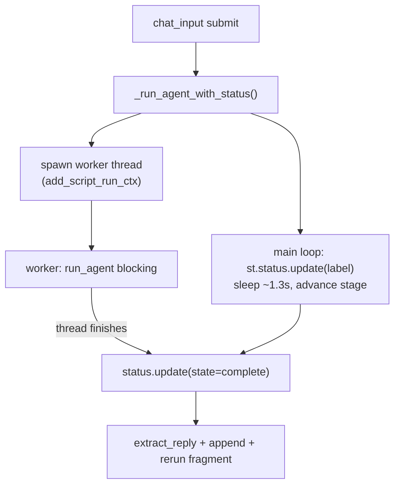

# Plan: Animated thinking buffer for the sidebar agent

## Context

Today the sidebar chat shows a static spinner while the agent runs, in [agent.py](c:\Users\dji\Exploration\vault_inv_test\vault_inv_dash\agent.py) (`render_assistant`, ~lines 316-331):

```python
with st.spinner("Thinking…"):
    response = run_agent(by_label[pick], ss["agent_msgs"])
```

`run_agent` uses `stream: false` (a single blocking JSON call). Per your choice, we keep the non-streaming call and instead animate a set of plausible high-level stage labels while it runs — no SSE. Since the call blocks, animation requires running the agent on a background thread while the main thread updates the label on a timer.

Key finding that shapes the design: `run_agent` calls `data._connection()`, which is `@st.cache_resource` and calls `st.connection(...)` ([data.py](c:\Users\dji\Exploration\vault_inv_test\vault_inv_dash\data.py) lines 79-110). A bare Python thread has no Streamlit ScriptRunContext, so touching `st.connection`/cache from it emits "missing ScriptRunContext" warnings and can misbehave. The fix is the documented pattern: attach the current context to the worker thread via `add_script_run_ctx(thread, get_script_run_ctx())`.

Why this animates live: updating an `st.status` label in a loop with short `time.sleep`s streams incremental UI updates to the browser (same mechanism as a progress-bar loop). Network I/O in `run_agent` releases the GIL, so the main-thread label loop runs while the request is in flight. This all happens inside the existing `@st.fragment`, so the dashboard stays put.



## Implementation steps

All changes in [agent.py](c:\Users\dji\Exploration\vault_inv_test\vault_inv_dash\agent.py). One file.

### 1. Add imports and a stage-label constant

Add near the top:
```python
import threading
import time
```
And a module-level constant (high-level labels only, per "just step labels"):
```python
_THINKING_STAGES = [
    "Reading your question…",
    "Consulting the semantic model…",
    "Drafting SQL…",
    "Querying Snowflake…",
    "Summarizing the results…",
]
_STAGE_INTERVAL_S = 1.3
```

### 2. Add `_run_agent_with_status(agent_name, messages)`

Runs `run_agent` on a worker thread (with the script-run context attached) and animates an `st.status` label from the main thread until it completes:

```python
def _run_agent_with_status(agent_name: str, messages: list[dict]) -> dict:
    """Call run_agent while animating a compact status label. Falls back to a
    plain spinner if the Streamlit context can't be attached to the worker."""
    try:
        from streamlit.runtime.scriptrunner import add_script_run_ctx, get_script_run_ctx
        ctx = get_script_run_ctx()
    except Exception:
        ctx = None

    if ctx is None:  # no context to hand off — keep it simple
        with st.spinner(_THINKING_STAGES[0]):
            return run_agent(agent_name, messages)

    box: dict = {}
    def _work() -> None:
        box["resp"] = run_agent(agent_name, messages)
    worker = threading.Thread(target=_work, daemon=True)
    add_script_run_ctx(worker, ctx)

    with st.status(_THINKING_STAGES[0], expanded=False) as status:
        worker.start()
        i = 0
        while worker.is_alive():
            worker.join(timeout=_STAGE_INTERVAL_S)
            if worker.is_alive():
                i = min(i + 1, len(_THINKING_STAGES) - 1)  # advance, clamp at last
                status.update(label=_THINKING_STAGES[i])
        status.update(label="Done", state="complete")
    return box.get("resp", {"__error__": "Agent thread returned no response."})
```

Notes: `st.status(..., expanded=False)` renders a single compact line with a spinner and updatable label — matching "just step labels." The status box only exists during this branch; the subsequent `st.rerun(scope="fragment")` re-renders the fragment showing the assistant message instead, so the box disappears cleanly.

### 3. Swap the call site in `render_assistant`

Replace:
```python
with st.spinner("Thinking…"):
    response = run_agent(by_label[pick], ss["agent_msgs"])
```
with:
```python
response = _run_agent_with_status(by_label[pick], ss["agent_msgs"])
```

Everything downstream (`extract_reply`, appending the assistant message with `_reply`, the DataFrame-history sanitization in `run_agent`, and `st.rerun(scope="fragment")`) is unchanged.

## Verification

1. Launch locally: `SNOWFLAKE_DEFAULT_CONNECTION_NAME=FANATICS_COLLECTIBLES_PROD` + `python -m streamlit run streamlit_app.py --server.headless true --server.port 8599`.
2. Ask a question (e.g. "Show total relic spend by brand as a table."). Confirm the buffer cycles through the stage labels ("Reading your question…" -> ... -> "Summarizing the results…") while the request runs, then the answer renders with its Details expander.
3. Confirm the dashboard stays bright during thinking (fragment isolation intact).
4. Ask a follow-up ("Now just the top 3 brands.") — confirm multi-turn still works and no serialization error (the run_agent contract is untouched).
5. Check the server log for absence of "missing ScriptRunContext" warnings (confirms the context handoff worked).
6. `py_compile agent.py` is clean.

## Critical Files

- [agent.py](c:\Users\dji\Exploration\vault_inv_test\vault_inv_dash\agent.py) - add `_run_agent_with_status` + stage constants; swap the spinner call site in `render_assistant`. Only file changed.
- [data.py](c:\Users\dji\Exploration\vault_inv_test\vault_inv_dash\data.py) - reference only: `_connection()` is `@st.cache_resource`/`st.connection`, which is why the worker thread needs `add_script_run_ctx`.
