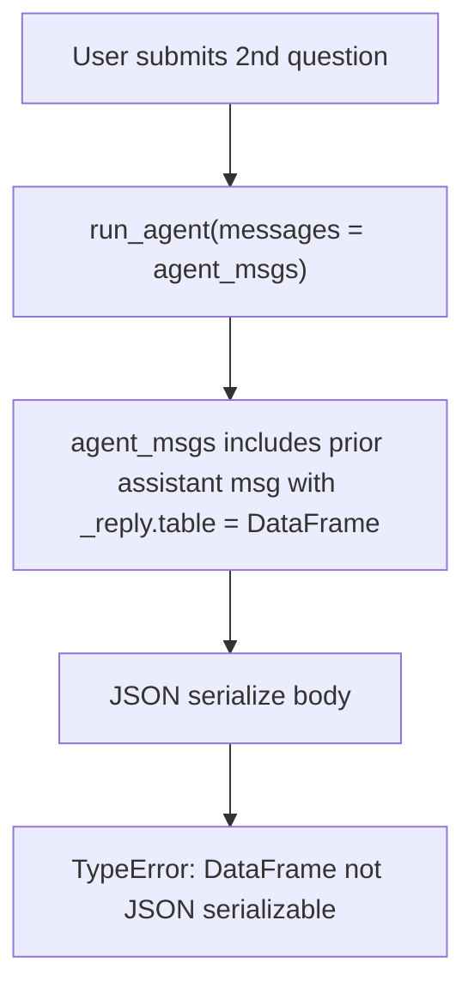

# Plan: Fix agent multi-turn serialization error

## Context

Second-prompt failure: `Agent request failed: Object of type DataFrame is not JSON serializable`.

Root cause traced in [agent.py](vault_inv_dash/agent.py):
- After each answer, `render_assistant()` appends an assistant message that mixes API fields with a rendering payload:
  ```python
  ss["agent_msgs"].append({
      "role": "assistant",
      "content": [{"type": "text", "text": reply.get("text", "")}],
      "_reply": reply,   # <- reply["table"] is a pandas DataFrame
  })
  ```
- `run_agent()` sends the whole list verbatim: `body = {"messages": messages, "stream": False}` ([agent.py:110](vault_inv_dash/agent.py)).
- First prompt: history is just the user message (no `_reply`) -> serializes OK. Second prompt: the previous assistant message (with `_reply` -> `table` DataFrame) is included -> `send_snow_api_request` / `requests` JSON encoding raises the error.

The `_reply` key is purely for local rendering (SQL/table/chart in the "Details" expander); it must never be sent to the API. The Agent Run API only expects `role` and `content` (optionally `status`/`error`) per the Cortex Agents Run API schema.



## Implementation steps

### 1. Sanitize messages before sending in `run_agent`

In [agent.py](vault_inv_dash/agent.py) `run_agent()`, replace:
```python
body = {"messages": messages, "stream": False}
```
with a version that keeps only the API-recognized fields per message:
```python
api_messages = [{"role": m["role"], "content": m.get("content", [])} for m in messages]
body = {"messages": api_messages, "stream": False}
```
This strips `_reply` (and any future local-only keys) and also avoids sending large embedded table data back to the model. `content` entries are already plain `{"type": "text", "text": ...}` dicts, so the result is fully JSON-serializable.

This is the single change needed; the storage shape in `agent_msgs` stays as-is so the sidebar's "Details" expander (which reads `_reply`) keeps working.

## Verification

- `python -m py_compile agent.py` passes.
- Launch locally (`SNOWFLAKE_DEFAULT_CONNECTION_NAME=FANATICS_COLLECTIBLES_PROD`, `.venv` Python, `streamlit run streamlit_app.py --server.headless true --server.port 8599`), open the sidebar assistant, and:
  1. Ask a first question that returns a table (so `_reply["table"]` is a DataFrame) — confirm the answer + Details table render.
  2. Ask a **second** question — confirm it now succeeds (no "DataFrame is not JSON serializable"), and the follow-up shows the agent used prior context (multi-turn still works).
- Confirm the "Details" expander (SQL/table) still renders for each assistant turn, i.e. stripping `_reply` from the request did not affect local rendering.
- Note: requires a valid (non-expired) Snowflake OAuth session for the `FANATICS_COLLECTIBLES_PROD` connection.

## Critical Files

- [vault_inv_dash/agent.py](vault_inv_dash/agent.py) - `run_agent()` builds the request body from the full history; sanitize messages to `role`+`content` here (the only change). `extract_reply()`/`render_assistant()` remain unchanged.