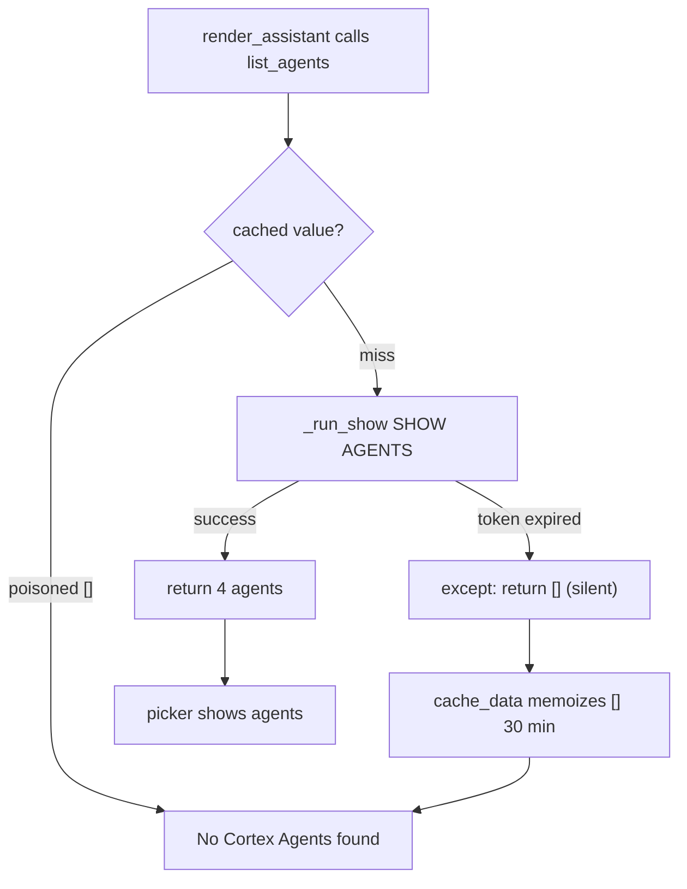

# Plan: Fix "No Cortex Agents found" cache-poisoning in the agent sidebar

## Context

The agents are not missing. `SHOW AGENTS IN SCHEMA ORACLE_DATA_PROD.SANDBOX` returns all 4 agents right now, under the same role the local app uses. The sidebar message is misleading — it fires whenever `list_agents()` returns `[]`, for any reason.

Two flaws in [agent.py](c:\Users\dji\Exploration\vault_inv_test\vault_inv_dash\agent.py) turn a momentary hiccup into a sticky, silent failure:

- **Failures are swallowed** — `list_agents()` wraps the call in `except Exception: return []` (lines 73-76). On a local `streamlit run`, `_run_show()` executes `SHOW AGENTS` through the Snowpark session, which rides the `FANATICS_COLLECTIBLES_PROD` OAuth session token. That token expires between/within sessions; when it lapses, `sess.sql(...).collect()` raises, the exception is discarded, and the function returns `[]`.
- **The empty result is cached for 30 minutes** — `list_agents()` is decorated `@st.cache_data(ttl=timedelta(minutes=30))` (line 65). `st.cache_data` memoizes return values, so that transient `[]` sticks for up to 30 minutes even after the connection recovers, with no error shown and no way to refresh short of restarting.

Key fact that makes the fix clean: `st.cache_data` does **not** cache exceptions. So simply *letting the error propagate* out of the cached function (instead of catching and returning `[]`) means transient failures no longer poison the cache — only genuine successes (including a real empty schema) get memoized.

Flow today:



## Implementation steps

### 1. Make `list_agents()` stop swallowing / caching failures ([agent.py](c:\Users\dji\Exploration\vault_inv_test\vault_inv_dash\agent.py) lines 65-94)

Remove the `try/except … return []` around `_run_show(...)`. Let any exception propagate out of the cached function. Keep the rest (row parsing, `profile.display_name`, sort) unchanged. A genuinely empty schema still returns `[]` and caches harmlessly; a failed call now raises instead of caching a fake empty result.

Concretely, the body becomes:
```python
@st.cache_data(ttl=timedelta(minutes=30), show_spinner=False)
def list_agents() -> list[tuple[str, str]]:
    rows = _run_show(f"SHOW AGENTS IN SCHEMA {_AGENT_DB}.{_AGENT_SCHEMA}")
    out: list[tuple[str, str]] = []
    for row in rows:
        ...  # unchanged parsing
    out.sort(key=lambda t: t[0].lower())
    return out
```

### 2. Surface the real error + add Retry in `render_assistant()` ([agent.py](c:\Users\dji\Exploration\vault_inv_test\vault_inv_dash\agent.py) lines 282-285)

Wrap the `list_agents()` call in `try/except`. On exception, show the actual message and a Retry button that clears the cache and reruns the fragment. Distinguish this from a truly empty schema.

```python
    try:
        agents = list_agents()
    except Exception as exc:  # noqa: BLE001 — surface, don't hide
        st.error(f"Couldn't load agents from {_AGENT_DB}.{_AGENT_SCHEMA}: {exc}")
        if st.button("Retry", key="agent_retry"):
            list_agents.clear()
            st.rerun(scope="fragment")
        return
    if not agents:
        st.info(f"No Cortex Agents found in {_AGENT_DB}.{_AGENT_SCHEMA}.")
        if st.button("Refresh", key="agent_refresh"):
            list_agents.clear()
            st.rerun(scope="fragment")
        return
```

Note the error text should hint at the local cause when relevant — an expired OAuth session token surfaces here as a connector/token error, which now becomes visible instead of hidden.

### 3. Optional: lightweight manual refresh affordance

Add a small "Refresh agents" caption-button near the agent picker (after step 2's control) so a user can force `list_agents.clear()` + `st.rerun(scope="fragment")` on demand without restarting — useful if agents are added while the app is open. Low priority; can fold into step 2's buttons.

## Verification

1. Re-authenticate the `FANATICS_COLLECTIBLES_PROD` OAuth connection, then launch locally:
   `SNOWFLAKE_DEFAULT_CONNECTION_NAME=FANATICS_COLLECTIBLES_PROD` + `python -m streamlit run streamlit_app.py --server.headless true --server.port 8599`.
2. Confirm the sidebar picker now lists the 4 agents (Athlete Relics, Athlete AUTO + RELIC Spend Agent, VAULT_DASH_AGENT_V060926, VAULT_PROD_AGENT_V060926).
3. Simulate a failure to prove no cache-poisoning: temporarily point `CORTEX_AGENT_SCHEMA` at a non-existent schema (or otherwise force `_run_show` to raise) and confirm the sidebar now shows a real `st.error` with the underlying message plus a working **Retry** button — not a silent "No Cortex Agents found."
4. After Retry (with a valid schema/connection), confirm the picker repopulates without restarting the app.
5. `py_compile agent.py` is clean.

## Critical Files

- [agent.py](c:\Users\dji\Exploration\vault_inv_test\vault_inv_dash\agent.py) - `list_agents()` (remove failure-swallowing) and `render_assistant()` (surface error + Retry/Refresh). The only file that needs changes.
- [data.py](c:\Users\dji\Exploration\vault_inv_test\vault_inv_dash\data.py) - reference only: `_connection()` / raw connector token path that expires locally and triggers the underlying error.
