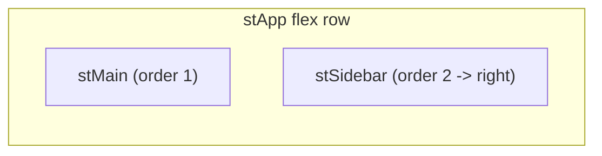

# Plan: Right-side sidebar + collapse reflow fix

Two changes to the sidebar assistant added earlier:
1. Move Streamlit's sidebar from the left to the right edge.
2. Fix the bug where collapsing the sidebar leaves an empty gap instead of the dashboard reflowing to fill it.

## Context

- The sidebar is Streamlit's native sidebar (`st.sidebar`), rendered by `agent.render_assistant()` in [agent.py](vault_inv_dash/agent.py). Streamlit has **no native option** to place the sidebar on the right, so this is done with CSS overrides.
- The only custom sidebar CSS today is an inline block in [agent.py](vault_inv_dash/agent.py):
  ```python
  st.html("<style>section[data-testid='stSidebar']{min-width:360px}</style>")
  ```
- **Root cause of the reflow bug:** that `min-width:360px` is applied to the sidebar `<section>` in *all* states. When the user collapses the sidebar, Streamlit shrinks it to reclaim space, but the unconditional `min-width` keeps the element (and its reserved layout width) at 360px, so the main content can't expand — leaving a blank gap. This only surfaced now because before this feature the sidebar had no content and was never opened.
- The app already centralizes page chrome CSS in [style.py](vault_inv_dash/style.py) via the `CSS` constant injected once by `style.inject_css()` (called in [streamlit_app.py](vault_inv_dash/streamlit_app.py) before `agent.render_assistant()`). Sidebar styling belongs there for consistency, rather than inline in `agent.py`.
- Target runtimes: local Streamlit 1.58 and the SiS container runtime (>=1.57 per [snowflake.yml](vault_inv_dash/snowflake.yml)). The `environment.yml`/warehouse-runtime (1.51) path was removed from the project, so only the 1.57+ DOM matters.

### Streamlit 1.57+ layout (from the earlier browser snapshots)

The app is a flex row: `[data-testid="stSidebar"]` (a `<section>`) and `[data-testid="stMain"]` are siblings; the reopen control when collapsed is `[data-testid="stExpandSidebarButton"]`. Moving the sidebar right is done by reordering the flex children (so Streamlit's own collapse/reflow logic keeps working) and flipping the collapsed reopen control to the right.



## Implementation steps

### 1. Remove the inline sidebar CSS from agent.py

In [agent.py](vault_inv_dash/agent.py) `render_assistant()`, delete the `st.html("<style>…min-width:360px…</style>")` line (the unconditional min-width is the reflow bug). Styling moves to `style.py`.

### 2. Add a scoped sidebar CSS block in style.py

Append a `_SIDEBAR_CSS` block to the `CSS` string in [style.py](vault_inv_dash/style.py) (so it ships through the existing `inject_css()` call). Intended rules:

```css
/* Place the sidebar on the right (Streamlit has no native option). Reordering
   the flex children keeps Streamlit's own collapse/reflow behavior intact. */
[data-testid="stSidebar"] { order: 2; }

/* Widen the sidebar ONLY while expanded, so collapsing it reclaims the space
   (the previous unconditional min-width caused the empty gap on collapse). */
[data-testid="stSidebar"][aria-expanded="true"] { min-width: 360px; max-width: 420px; }

/* When collapsed, the reopen control defaults to the top-left; move it right. */
[data-testid="stExpandSidebarButton"],
[data-testid="stSidebarCollapsedControl"] { left: auto; right: 0.5rem; }
```

These are page-level (not `.fct`-scoped) selectors, consistent with the existing global vega-embed rule already in `_CHROME_CSS`. The exact attribute/testid names (`aria-expanded`, `stExpandSidebarButton`, flex `order` on the correct parent) will be **verified against the live DOM** in step 3 and adjusted if the running build differs — e.g. if the flex parent needs `flex-direction`/`order` on a different node, or the expanded state is keyed by an inline width rather than `aria-expanded`.

### 3. Verify and tune live

Run the app locally, then use browser DevTools / the browser tools to confirm: sidebar renders on the right, expand/collapse works, and on collapse the dashboard content expands to fill the width with no leftover gap. Tune selectors if the DOM differs from the assumptions above.

## Verification

- Launch: `SNOWFLAKE_DEFAULT_CONNECTION_NAME=FANATICS_COLLECTIBLES_PROD` then `streamlit run streamlit_app.py --server.headless true --server.port 8599` using the project `.venv` Python.
- Manual checks in the browser:
  1. The "Ask the data" sidebar appears on the **right** edge.
  2. Collapse the sidebar (the `<<` / arrow control) — the dashboard cards, tables, and charts **reflow to fill the full width**, no empty gap on the right.
  3. Reopen it — the reopen control is on the right and the sidebar returns at ~360px.
  4. Sidebar chat still works (agent picker, ask a question, answer renders).
- Confirm no `<style>` text leaks visibly (the block goes through `st.html`, not `st.markdown`).
- `python -m py_compile agent.py style.py streamlit_app.py` passes.

## Critical Files

- [vault_inv_dash/style.py](vault_inv_dash/style.py) - Add the `_SIDEBAR_CSS` block to the injected `CSS`; central place for the right-position + expanded-scoped width + collapsed-control rules.
- [vault_inv_dash/agent.py](vault_inv_dash/agent.py) - Remove the inline `min-width` `st.html` line that causes the collapse gap.
- [vault_inv_dash/streamlit_app.py](vault_inv_dash/streamlit_app.py) - No change needed; `style.inject_css()` already runs before `agent.render_assistant()`, so the new CSS applies to the sidebar.