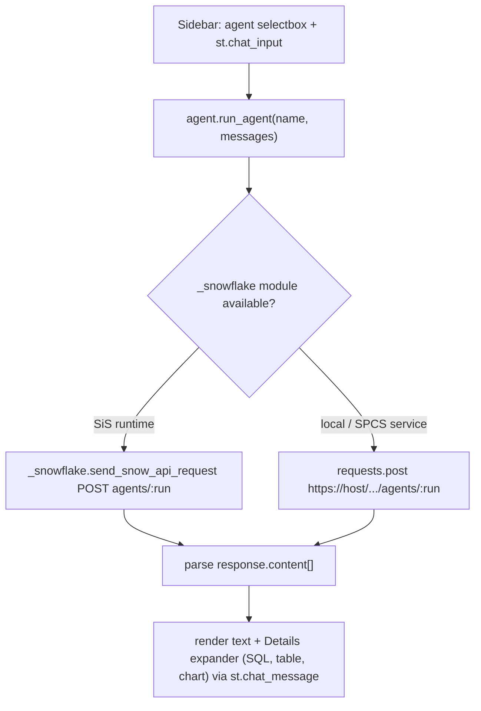

# Plan: Sidebar Cortex Agent assistant

Add a sidebar assistant that lets the user pick a Cortex Agent and ask questions in a multi-turn chat. Per your choices: **sidebar-only** rendering, agents scoped to the **app schema** (`ORACLE_DATA_PROD.SANDBOX`), **multi-turn** conversation.

## Context

- The app is a single-page Streamlit dashboard ([streamlit_app.py](vault_inv_dash/streamlit_app.py)) with top controls + 3 tab renderers. It has **no sidebar** today, so the sidebar is free for the assistant.
- Snowflake access goes through `data._connection()` in [data.py](vault_inv_dash/data.py), a cached `st.connection("snowflake")`. That module already has the dual-runtime detection we need: `data._running_in_snowflake()` and `data._SPCS_TOKEN_PATH`.
- Deploy target ([snowflake.yml](vault_inv_dash/snowflake.yml)) is SiS on the **container runtime** into `ORACLE_DATA_PROD.SANDBOX`, running as `POWER_ANALYST_ORACLE_PROD`. `SHOW AGENTS IN ACCOUNT` confirms that role **owns 4 PROD agents in that schema** (e.g. `ATHLETE_RELIC_AGENT_6182026`, `AUTO_RELIC_AGENT_6182026`, `VAULT_PROD_AGENT_V060926`, `VAULT_DASH_AGENT_V060926`), each with a `profile.display_name`.
- Cortex Agent Run API (confirmed via docs): `POST /api/v2/databases/{db}/schemas/{schema}/agents/{name}:run`. We will send `"stream": false` with `Accept: application/json` to get a **single JSON response** (the aggregated `response` object with a `content[]` array) — far simpler than parsing SSE. `messages` carries the full conversation history when `thread_id` is omitted, which gives us multi-turn for free.
- Runtime constraint: local venv is Streamlit 1.58, container runtime is >=1.57, warehouse-runtime option is 1.51. `st.chat_input`/`st.chat_message` inline-in-sidebar is supported on all three (inline placement since 1.39). No new hard dependency: the SiS path uses the built-in `_snowflake` module (no External Access Integration needed — it is an internal request, so the "no egress" note in [deploy/README-sis.md](vault_inv_dash/deploy/README-sis.md) still holds); the local path uses `requests`, which ships transitively with `snowflake-connector-python`.

### Data flow



## Implementation steps

### 1. New module `agent.py` — listing + REST client

Create [agent.py](vault_inv_dash/agent.py) reusing `data`'s connection and runtime detection.

- Constants (mirror `data._WAREHOUSE` env pattern):
  ```python
  _AGENT_DB = os.getenv("CORTEX_AGENT_DB") or "ORACLE_DATA_PROD"
  _AGENT_SCHEMA = os.getenv("CORTEX_AGENT_SCHEMA") or "SANDBOX"
  _AGENT_TIMEOUT_S = 120
  ```
- `list_agents()` — `@st.cache_data(ttl=timedelta(minutes=30))`; runs `SHOW AGENTS IN SCHEMA {_AGENT_DB}.{_AGENT_SCHEMA}` via `data._connection().query(...)`, parses `name` and `profile` (JSON string → `display_name` fallback to `name`). Returns an ordered list of `(display_label, agent_name)`. Empty/permission errors return `[]` so the UI can show a friendly message.
- `run_agent(agent_name, messages)` — builds the request body `{"messages": messages, "stream": false}`, `path = f"/api/v2/databases/{_AGENT_DB}/schemas/{_AGENT_SCHEMA}/agents/{agent_name}:run"`, and dispatches over three cases:
  1. **SiS**: `import _snowflake` → `_snowflake.send_snow_api_request("POST", path, {}, {}, body, None, _AGENT_TIMEOUT_S*1000)`; `json.loads(resp["content"])`; treat non-2xx `resp["status"]` as error.
  2. **Standalone SPCS service** (token file present, no `_snowflake`): `requests.post` to `https://{SNOWFLAKE_HOST}{path}` with `Authorization: Bearer {token}` + `X-Snowflake-Authorization-Token-Type: OAUTH`.
  3. **Local `streamlit run`**: pull the raw connector off the cached connection — `raw = data._connection().raw_connection` → `host = raw.host`, `token = raw.rest.token`; `requests.post(f"https://{host}{path}", ...)` with header `Authorization: 'Snowflake Token="{token}"'`.
  All paths set `Content-Type: application/json`, `Accept: application/json`, and return the parsed `response` dict (or raise/return a structured error).

### 2. Response-content parsing

In `agent.py`, add `extract_reply(response) -> dict` that walks `response["content"]` and collects:
- **text** blocks → concatenated markdown answer (the main sidebar message).
- **tool_use** of type `cortex_analyst_text_to_sql` / `system_execute_sql` → capture generated `sql` (from `input.sql` or the analyst delta) for a **Details** expander.
- **table** blocks (or `tool_result` `result_set`) → build a `pd.DataFrame` from `resultSetMetaData.rowType[*].name` + `data`.
- **chart** blocks → keep `chart_spec` (vega-lite JSON string) for optional `st.vega_lite_chart`.
- **thinking** → ignored by default (kept out of the sidebar to reduce noise).
Unknown types are skipped so future event types don't break rendering. Returns `{"text", "sql", "table", "chart_spec", "error"}`.

### 3. `render_assistant()` — sidebar chat UI

In `agent.py`, add `render_assistant()` that renders entirely inside `st.sidebar`:
- Header + `st.selectbox` of agent display labels from `list_agents()`. If empty, show `st.info("No Cortex Agents found in ORACLE_DATA_PROD.SANDBOX")` and stop.
- Session keys namespaced to avoid clashing with the dashboard's `ss`: `ss.setdefault("agent_pick", <first>)`, `ss.setdefault("agent_msgs", [])`. **Switching agents clears `agent_msgs`** (start a fresh thread).
- Replay history with `st.chat_message(role)`; assistant turns render the answer markdown plus a collapsed **Details** expander (generated SQL as a code block, result `st.dataframe`, and chart if present).
- `st.chat_input("Ask about the inventory data…")` (inline in the sidebar). On submit: append `{"role":"user","content":[{"type":"text","text":q}]}`, call `run_agent(name, ss.agent_msgs)` inside `with st.spinner`, parse via `extract_reply`, append the assistant message, `st.rerun()`.
- A small **Clear chat** button resets `agent_msgs`.
- Errors from `run_agent` render as `st.error(...)` in the sidebar (including a note to re-run if a local session token expired — API returns 200 with error code `390112`).
- Optional: widen the sidebar slightly for readability via a one-off `st.markdown("<style>section[data-testid='stSidebar']{min-width:360px}</style>", unsafe_allow_html=True)` (kept minimal; the dashboard's look comes from `style.py`).

### 4. Wire into the app

In [streamlit_app.py](vault_inv_dash/streamlit_app.py), add `import agent` with the other imports and call `agent.render_assistant()` once, right after `style.inject_css()` (line ~27) so the sidebar is present on every tab. No changes to the existing main-area render functions.

### 5. Packaging / deploy manifests

- [snowflake.yml](vault_inv_dash/snowflake.yml): add `- agent.py` to the `artifacts:` list (otherwise it deploys silently without the new module and errors at import).
- [pyproject.toml](vault_inv_dash/pyproject.toml): add `"agent"` to `[tool.setuptools] py-modules` so editable installs keep working. Dependencies unchanged (`requests` is transitive via `snowflake-connector-python`; SiS uses `_snowflake`).
- [environment.yml](vault_inv_dash/environment.yml) (warehouse-runtime option): no change needed — the SiS path imports `_snowflake`, not `requests`.

## Verification

- **Local**: `SNOWFLAKE_DEFAULT_CONNECTION_NAME=FANATICS_COLLECTIBLES_PROD uv run streamlit run vault_inv_dash/streamlit_app.py` (matches [data.py](vault_inv_dash/data.py) defaults). Confirm: sidebar lists the 4 PROD agents; asking "What is total on-hand valuation by brand?" returns a text answer; the Details expander shows generated SQL and a result table; a follow-up ("now just for the top 3") uses prior context; switching agents clears the thread.
- **Import check**: `uv run python -c "import agent"` — ensures no syntax/import errors and that `requests`/`_snowflake` imports are properly guarded.
- **Deploy**: `snow streamlit deploy --replace --open --role POWER_ANALYST_ORACLE_PROD`; then `SHOW STREAMLITS LIKE 'VAULT_INV_DASH' IN ACCOUNT` to confirm the object. In Snowsight, verify the sidebar assistant works in-DB (uses the `_snowflake` internal path, no EAI).
- **Grant note**: the Agent Run API requires the running role's default role to hold `SNOWFLAKE.CORTEX_USER` (granted to `PUBLIC` by default). If revoked, add to [deploy/setup-sis.sql](vault_inv_dash/deploy/setup-sis.sql): `GRANT DATABASE ROLE SNOWFLAKE.CORTEX_USER TO ROLE POWER_ANALYST_ORACLE_PROD;`

## Critical Files

- [vault_inv_dash/agent.py](vault_inv_dash/agent.py) - New module: agent listing, dual-path Agent Run REST client, response parsing, and the sidebar chat UI.
- [vault_inv_dash/streamlit_app.py](vault_inv_dash/streamlit_app.py) - Add `import agent` and a single `agent.render_assistant()` call after CSS injection.
- [vault_inv_dash/data.py](vault_inv_dash/data.py) - Reused for `_connection()`, `_running_in_snowflake()`, and `_SPCS_TOKEN_PATH`; no changes required.
- [vault_inv_dash/snowflake.yml](vault_inv_dash/snowflake.yml) - Add `agent.py` to `artifacts` so it deploys to SiS.
- [vault_inv_dash/pyproject.toml](vault_inv_dash/pyproject.toml) - Add `agent` to `py-modules`.